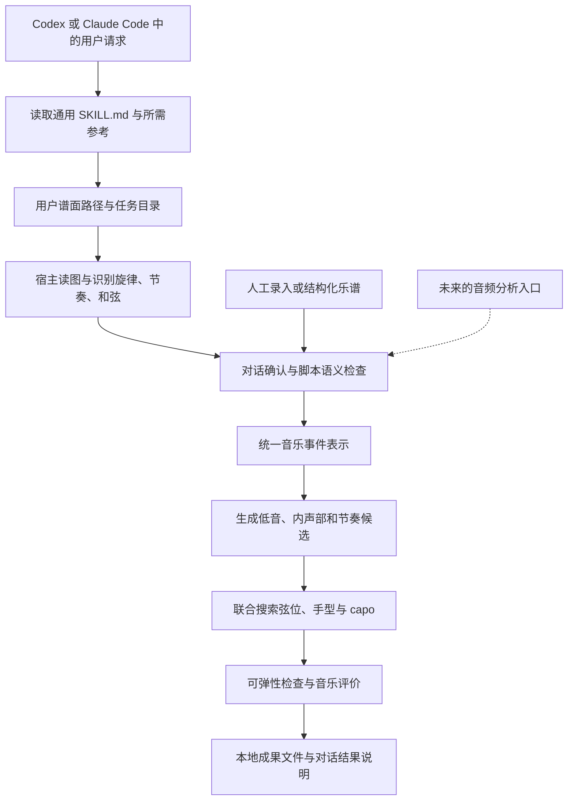

# Melody2Fingerstyle Skill 项目策划案

版本：讨论稿 v0.4 · 2026-10-03

当前产品定位为供 Codex 与 Claude Code 使用的 skill。已有策划文档、两份本地弹唱谱和首段符号转录草稿，尚无业务代码、可安装的 skill 包或双宿主测试结果。本文件提出开发方向、首版边界和验收方法，文中的能力均为规划，不代表已经实现。另一份本地仓库中的旧策划案尚未读取，本稿独立整理，后续可对照合并。样谱检查与待核对事项见[首批弹唱谱检查](score-intake.md)。

## 1. 产品目标与核心判断

近期目标：用户在 Codex 或 Claude Code 中提供包含主旋律简谱和和弦标记的本地弹唱谱，由 skill 组织识谱、必要的对话确认、编配、自动 capo 搜索与导出，交付可以继续修改和试听的吉他独奏指弹谱。

产品交付物是一份可移植的 skill 包，包含工作流说明、必要的音乐规则和可复用的计算脚本。宿主承担对话、读图与工具调用；项目重点实现音乐数据、编配、指法搜索和校验。首版不建设独立网站、上传服务或专用乐谱编辑器。

远期目标：从音频中提取主旋律、和弦与节奏信息，接入同一套指弹编配引擎。这里首先指“根据歌曲重新编配指弹”，而非准确复刻录音中演奏者每个音的弦位和指法。

建议首版面向“会基础和弦，正在学习指弹”的玩家，以标准调弦、抒情流行曲、慢到中速片段为主要验证范围。输入形式暂按图片或扫描 PDF 设计，具体以实际样谱为准。

核心判断：产品的价值在于，在保留歌曲辨识度的前提下，找到适合用户能力的编配。主旋律与和弦提供音乐骨架，但仍需决定低音、内声部、节奏织体，以及整段音乐的弦位和手型。

优先级建议：

1. 输出满足已经定义的演奏约束；不满足时明确说明无可行结果。
2. 在默认保真模式下，保持确认后的旋律音高、起音和时值。
3. 保留主要和声功能、低音走向与节奏骨架。
4. 在难度预算内增加内声部、音色变化和装饰。

可弹性模型只能筛掉已知问题，最终仍需要真人在目标速度下试弹。

## 2. 用户会得到什么

典型流程：在宿主对话中提供谱面路径与转换要求 → skill 检查输入和运行环境 → 识别并核对旋律与和弦 → 调用脚本自动比较 capo 与编配 → 返回乐谱、试听文件和简要说明 → 根据对话反馈修改局部。

典型请求：“把这份弹唱谱转成指弹谱，保持原调，自动选 capo，输出到指定目录。”后续可以说：“第 7 小节换把太急，保留旋律，减少这里的伴奏。”用户不用先把谱转成 JSON，也不需要选择难度档位。

| 环节 | 首版行为 | 解决的问题 |
| --- | --- | --- |
| 输入 | 从用户提供的路径或宿主可访问附件读取清晰图片、PDF，或已确认的结构化乐谱 | 让用户能使用现有弹唱谱 |
| 核对 | 在对话中引用页码、小节和必要的裁图，列出确实影响生成的识谱疑点 | 防止识谱错误变成编配错误 |
| 自动分析 | 默认保持原调，自动比较包含不夹变调夹在内的 capo 候选及对应编配 | 将可弹性和音乐效果的权衡交给系统 |
| 生成 | 输出一个综合效果最好的推荐版本，标明 capo 与选择理由 | 用户无需选择难度档位或手动比较 capo |
| 预览 | 返回六线谱 PDF/图片、旋律及整段 MIDI；宿主能展示时直接展示，否则提供文件路径 | 同时检查声音与演奏位置，不依赖内嵌播放器 |
| 修改 | 将对话反馈转为明确的小节范围、弦位锁定或伴奏调整，校验后重算并保留版本 | 允许演奏者参与编配，并可在新会话继续 |
| 交付 | MusicXML、MIDI 和编配数据作为核心成果；有渲染工具时补充 PDF/图片，说明缺失产物 | 同时满足修改、练习和后续处理 |

结果说明应指出具体原因，例如“第 6 小节在一个八分音符间隔内换把”，而不是只给一个缺乏解释的综合分数。读取不了图片或缺少某类导出工具时，明确报告受影响步骤；不能把文字建议当成已生成的乐谱文件。

## 3. 首版范围与暂缓内容

首版先支持六弦吉他标准调弦、单条主旋律、明确的和弦序列、常见大小三和弦与七和弦，以及 4/4、3/4、6/8 的基础节奏模板。6/8 的强弱拍与分组需要单独处理，不能直接套用 3/4 模板。

按已提供的实际样谱，第一段《雨爱》第 5–12 小节至少需要支持 `E`、`C#m7`、`Asus2`、`Bsus2`；第二段《晴天》再加入 `maj7`、`add9`、六和弦与指定低音。先围绕这些实际出现的类型扩展和弦解析，不把它们未经说明地替换成普通三和弦。

先用 8–16 小节片段验证，再扩展到完整歌曲。只支持明确声明的谱面版式；遇到未支持的和弦、节奏或符号应标出，交给用户补全。

第一轮编配从“旋律 + 简单低音”做起，再加入稀疏的和弦内声部。不提供难度档位选择；横按、伸展、换把速度和伴奏密度仍由系统内部约束与评分处理，自动输出兼顾音乐效果和可弹性的一个版本。

暂缓：任意手写简谱、任意扫描质量、复杂复调输入、特殊调弦、部分变调夹、曲中更换 capo、人工泛音、打板、复杂击勾弦、自动模仿名家风格、从零训练端到端模型，以及完整商业混音的全自动转谱。

这些内容会分别引入新的识别、演奏或数据问题，不应成为验证核心编配能力的前置条件。

## 4. 总体技术路线



编配候选与指法搜索需要互相反馈。某种和弦配置如果无法与旋律一起演奏，应该回退到更稀疏的配置；不能先把伴奏完全固定，再要求指法模块强行实现。

建议用 Python 实现可独立运行的核心和命令行入口，数据使用带版本号的结构化格式。skill 指导宿主完成读图、确认和脚本调用；将音高转换、约束检查、搜索和导出固化为可验证的实现。首版复用宿主对话与本地文件，不把前端框架、Web 服务或数据库列为前置工作。

### 4.1 统一音乐表示是第一项基础工作

至少区分三类信息：原谱解释、音乐编配、具体演奏位置。

| 对象 | 需要保留的信息 |
| --- | --- |
| 乐曲与小节 | 拍号、速度、调性、弱起、反复与段落关系 |
| 旋律事件 | 绝对音高、起点、时值、休止、连音线、声部、原图位置 |
| 和弦事件 | 和弦性质、起止位置、转位或指定低音、原始写法 |
| 音高解释 | 简谱的 `1=`、八度、和弦是实际和弦还是指型名称、原谱 capo |
| 演奏配置 | 调弦、capo、允许移调量、最高物理品位、难度限制 |
| 输出音符 | 声部角色、弦号、相对 capo 品位、物理品位、按弦手指、实际保持时长 |
| 修订记录 | 哪些字段人工确认、哪些地方简化或修改，以及修改原因 |

时间使用有理数拍长，并明确基准，例如以四分音符为 1；不要用容易累积误差的小数拼接小节。弱起、延音线和反复记号需要显式表示，分析时可以展开演奏顺序，同时保留回到原谱的位置映射。

内部音高统一采用实际发声音高。吉他五线谱可能涉及八度移调记谱，导入与导出时统一转换，避免高低错一个八度。

### 4.2 图片识谱：AI 辅助，校正闭环必需

需要识别的不只是数字，还包括上下八度点、减时线、增时线、附点、临时升降号、休止、连音线、小节线，以及和弦对应哪一拍。

优先使用宿主已有的读图能力输出结构化草稿；PDF 可先由本地工具渲染为图片。语义检查负责发现小节时值不匹配、缺少调号、和弦位置不明等问题。模型自己声称的置信度不能直接当成可靠概率，应在数据与对话说明中结合检测到的矛盾和人工确认状态标记疑点。只询问会改变音乐解释或阻止当前步骤继续的问题。

不把本会话专有的工具名、其他已安装 skill 或某一家模型 API 写成必需条件。读取不了图像时，可接收已确认的结构化输入或说明缺少的能力；不以猜测补齐音符。首版不另建一套大模型 API 调用链，后续只有在宿主能力不足且收益明确时再考虑专用识谱服务。

只写了 `1 2 3 5`、没有时值和拍号的内容，不足以恢复完整旋律。缺失的信息需要补录，不能默默猜成均匀四分音符。

开发上先用人工核对过的结构化输入验证编配，再把少量清晰样谱接到宿主读图流程；“人工输入的技术原型”不是从谱面请求到成果文件的最终完成标准。

### 4.3 音乐编配：按角色分配有限的演奏资源

把输出分成旋律、低音、和声内声部三个角色：旋律优先；低音交代和声与节拍；内声部补充丰满度。

候选策略包括：和弦变化处或合适强拍加入低音、旋律空隙加入分解和弦、密集旋律处减少伴奏、乐句结尾使用稍完整的和声。并非每个旋律音都需要配一个完整六弦和弦。

常见和弦手型可以作为搜索候选，但允许省略重复音、改变配置、选用局部手型。三音、七音等和声识别信息按具体和弦决定保留优先级；不能简单认为“音越多越好”。

主旋律可以有经过音、倚音等非和弦音。检查伴奏与和弦的关系时，不能把这些旋律音一律判错。默认让旋律处于清楚的上方声部；这是一种首版编配偏好，不是所有指弹音乐的绝对规则。

对于 `C/E` 等斜杠和弦，先识别用户指定的低音语义，再决定吉他上的八度与位置，不能直接按根音 C 处理。

### 4.4 Skill 包与双宿主适配

采用 Agent Skills 的通用 `SKILL.md` 结构，前置信息使用 `name` 和 `description`；入口只保留触发范围、必要流程和关键音乐约束，详细规则与数据格式按需读取。[Agent Skills 规范](https://agentskills.io/specification)

拟定源码结构如下；这些文件尚未创建，按实现需要逐步加入：

```text
skills/melody2fingerstyle/
  SKILL.md                       触发、工作流、关键约束与成果要求
  references/music-rules.md       编配、延音、指法与 capo 规则
  references/data-format.md       输入、输出和修订数据约定
  scripts/m2f.py                  本地命令行入口与必要的核心实现
```

后续代码增多时在包内拆分核心模块；运行依赖及版本随实现声明。包内资源使用相对路径定位，不依赖本仓库外的私有文件或固定盘符。`docs/` 继续存放产品策划与开发记录，不将整份策划案复制到 `SKILL.md`。没有明确用途时不添加模板、图标或额外文件。

两端维护同一份 skill 源码和同一套脚本，安装位置与调用入口分别说明：

| 宿主 | 项目级发现位置 | 显式调用示例 |
| --- | --- | --- |
| Codex CLI / IDE | `.agents/skills/melody2fingerstyle/SKILL.md` | 在对话中引用 `$melody2fingerstyle` |
| Claude Code | `.claude/skills/melody2fingerstyle/SKILL.md` | 在对话中使用 `/melody2fingerstyle` |

上述发现路径与调用方式依据当前官方文档；它们相对于实际工作项目，源码目录 `skills/` 本身不等于已经安装。发布或本地测试时将同一版本的完整包放到相应位置，不分别手工维护两套规则。[OpenAI 官方 skill 文档](https://learn.chatgpt.com/docs/build-skills)、[Claude Code 官方 skill 文档](https://code.claude.com/docs/en/skills)

共享内容不依赖 Claude 专有的参数替换、工具白名单或子代理配置；Codex 的 `agents/openai.yaml` 如后续需要，只承载该端的可选元数据。首版先验证本地安装；插件市场包装与 MCP 服务不属于当前必需交付。

### 4.5 运行环境、文件契约与继续修改

skill 调用已测试的脚本，不要求宿主每次临时重写指法算法。拟定命令行职责是环境检查、谱面准备、输入校验、编配搜索、成果导出；命令细节随实现确定，此处不是已经可运行的命令清单。

首次运行检查 Python、实际使用的依赖、PDF 渲染及乐谱导出工具，按宿主权限和用户授权处理安装。依赖按处理阶段区分：缺少 PDF 渲染器会影响图像输入，但不应阻止已经确认的 JSON 进入编配；缺少 PDF 导出工具时保留核心结果并说明限制。脚本处理中文和空格路径，运行时不假定当前目录就是 skill 安装目录。

每个任务在用户工作区拥有独立输出目录；skill 安装目录只放程序和参考资料。建议保留以下文件作为两端共用的处理依据：

| 文件 | 职责 |
| --- | --- |
| `source.json` | 经校验的音乐事件、源谱定位、稳定事件 ID、确认状态与版本；未确定的关键字段继续保留未知 |
| `arrangement.json` | 选定的整曲 capo、生成声部、弦品、持续音与用户锁定 |
| `report.json` | 校验结果、capo 候选评价、取舍、失败位置和生成配置 |
| `run.json` | 源文件标识、输入版本、引擎版本、已完成阶段与成果路径，供中断后继续 |
| `arrangement.musicxml`、`preview.mid` | 可编辑乐谱与试听交换文件；渲染条件满足时增加 PDF/图片 |

用户无需编辑这些文件，宿主负责将自然语言修订转换为数据。现有《雨爱》`draft.json` 是相对音符草稿，需要确认音区并转换后才能作为正式输入；不能仅改文件名就视为完成校验。

局部修改生成新版本，保留原始输入与已确认内容。重算范围要包含相邻手型和边界持续音，默认沿用当前整曲 capo；若需要重新选 capo，则重新评价整首或整个已生成片段，不能在单个小节悄悄改变。重新打开会话或更换宿主后从这些文件继续，不只依赖聊天记忆。

## 5. 如何处理可弹性、同音异位与变调夹

### 5.1 同音异位需要联系上下文选择

标准调弦、不夹 capo 时，E4 可以在 1 弦 0 品、2 弦 5 品或 3 弦 9 品等位置发出。音高相同，但手型、音色、延音能力和对其他声部的占用不同。

因此搜索对象应是“整段的演奏状态序列”。每个状态包含新起音、仍在持续的音、各音所在弦品、占用的按弦手指，以及当前手型。计算换把代价时还要考虑速度和可用时间。

例如：E4 需要持续两拍，若用 1 弦空弦演奏，下一拍又在同一根弦弹 F4，就会截断 E4。两个时刻单独看都容易演奏，连起来却破坏了持续音。搜索器需要改伴奏、换弦位，或在允许简化的模式下明确记录缩短延音。

### 5.2 硬约束与软目标要分开

| 类型 | 示例 | 处理方式 |
| --- | --- | --- |
| 物理合法性 | 同一根弦不能同时维持两个不同的普通按弦音；品位不能越界 | 不合法候选直接排除 |
| 持续与占用 | 已按住的持续音占用相应弦和手指，不能被后续事件无声覆盖 | 状态中保留占用，验证转移 |
| 手型可行性 | 四个常规按弦手指的分配、允许的横按、伸展与手指冲突 | 用保守手型模板及显式手指约束筛选 |
| 右手可行性 | 同时拨弦数量、连续拨弦密度、跳弦与节奏 | 首版用保守模板约束，复杂指序后续扩展 |
| 保真与用户编辑 | 保持原调与旋律；尊重用户编辑后锁定的弦位 | 作为生成或局部重算的硬约束 |
| 演奏舒适度 | 换把距离、换把速度、伸展、重复横按、难点集中 | 在合法候选内比较成本 |
| 音乐质量 | 旋律突出、低音流畅、和声完整度、伴奏节奏与段落一致性 | 在难度预算内优化 |

“最多四个手指”不能直接写成“最多四个按弦音”，因为横按可以让一个手指负责多根弦。反过来，品位跨度很小也不代表必然能按，需要检查手指分配和持续音。

伸展上限、允许横按类型、最快换把等作为系统内部的可弹性参数，首版采用统一的保守基线，随后根据试弹反馈调整，不要求用户逐项设置。低把位和高把位的实际品间距离不同，首版可先用保守近似，不宣称一个固定品差适合所有人。

### 5.3 变调夹与移调是两个独立变量

设原始发声音高为 `p`，允许的整体移调为 `k`，某弦不夹 capo 时的空弦音高为 `T[s]`，capo 在物理第 `c` 品，音符相对 capo 的品位为 `f`。内部关系定义为：

```text
p + k = T[s] + c + f
实际按弦品位 = c + f
```

弦号统一按 1 弦最高、6 弦最低；标准调弦的 MIDI 音高为 `T[1..6] = [64, 59, 55, 50, 45, 40]`。相对品位 `f = 0` 表示以 capo 为起点的空弦。

默认保持原调，即 `k = 0`，自动比较 capo 0–5 品的候选，其中 0 表示不夹变调夹；这是首版搜索范围，后续依据样谱验证是否需要扩大。每个 capo 候选都要重新计算音域、手型、可用低音、最高物理品位和整段代价，不能仅把现成六线谱的数字整体平移。

“效果最好”定义为：先排除违反物理约束、改变已确认旋律或超过内部可弹性上限的方案，再综合比较旋律突出程度、和声与低音完整度、节奏连贯性、延音效果和换把舒适度。比较时采用相同的目标速度与评分标准，兼顾整段表现和最难的小节；不能仅凭横按最少或音符最多选出结果。

系统在已搜索的可行候选中选出综合评分最高的版本，展示 capo 位置和主要取舍理由；评分规则需要用试弹反馈校准，不宣称存在适合所有人的绝对最佳版本。一次生成的整首歌曲采用同一个 capo；片段试验只代表该片段的推荐结果，扩展到整曲时需要重新评估。所有候选均不可行时报告原因，不强行选一个。

例如实际 D 大三和弦可以采用 capo 2 配 C 和弦指型。此时实际和弦仍是 D；若继续把指型名称 C 当成实际和弦，后续和声和旋律就会错位。原谱已有 capo 时，必须先解释清楚原调、选调、指型和弦的关系，再生成实际音高，避免把 capo 重复计算两次。

capo 会抬高最低可用音：标准调弦夹 2 品后，6 弦空弦从 E2 变成 F♯2，因此部分低音方案会失效。它也会减少剩余可用品位，不能默认夹得越高越容易。

如果用户允许移调，再额外搜索 `k`，并在结果中明确展示原调、目标调、capo 和指型调。八度调整同样属于明确的音乐改动，不应隐含在“保持原调”里。

### 5.4 搜索算法从可解释基线开始

建议从手型模板和稀疏编配候选出发，建立按时间连接的状态图：节点表示可行状态，边表示可行转移。事件边界包括音符起止和和弦变化；对延音占用的处理贯穿小节边界。

小规模候选集合可以用动态规划求解；状态增多后再考虑束搜索等近似方法。动态规划只在状态信息充分、代价可分解且候选集固定时给出该候选集内的最优结果；束搜索不保证全局最优。不要把搜索被剪枝后的“没找到结果”说成音乐本身不可能演奏。

评价顺序建议：先排除违反硬约束的结果，再检查最难处是否超过系统内部的可弹性上限，最后比较整段舒适度与音乐效果。这样可以防止平均分不错却藏着一个弹不下来的小节；这套评价在后台运行，无需用户选择难度档位。

局部修改时，重新搜索相邻乐句并固定边界处仍在持续的音。不能只重算一个孤立小节，导致前后手型或延音无法衔接。

### 5.5 不可行时怎么处理

对每个 capo 的编配候选按可解释的顺序回退：减少重复和声声部 → 减少填充节奏 → 替换低音或和弦配置。各 capo 下的可行结果统一参与比较；不能找到第一个可行 capo 就结束搜索。可缩短的伴奏延音需要记录；默认保真模式下不自动修改旋律。

如果仍失败，应区分输入信息缺失、当前配置无可行候选、搜索资源不足三种情况。可以提出放宽横按、降低速度、换调或调整八度的建议，由用户选择后再生成；不能悄悄删掉旋律音并宣称转换成功。

## 6. 宿主 AI、Skill 与确定性程序的分工

| 工作 | 建议承担者 | 原因 |
| --- | --- | --- |
| 请求理解、步骤组织与结果说明 | 宿主 AI 按 skill 指导执行 | 复用 Codex / Claude Code 的对话和工具能力 |
| 图片版面和符号理解 | 宿主读图能力 + 必要的对话校正 | 需要处理不同版式和图像噪声 |
| 结构化校验、音高转换 | 确定性程序 | 音高、时值和 capo 关系应可复算 |
| 基础编配候选 | 音乐规则、节奏模板、手型词表 | 便于建立稳定基线与解释失败 |
| 指法选择与约束检查 | 搜索算法 + 独立校验器 | 每个弦品和状态转移都能检查 |
| 风格变化与文字解释 | 后续加入模型辅助 | 不应覆盖已经锁定的约束 |
| 候选排序改进 | 有足够人工反馈后再考虑学习模型 | 先有可衡量的目标和可信样本 |

skill 中的文字规则用于指导决策，不能替代已执行的约束检查和导出程序。不建议第一版让大模型直接吐出最终六线谱。即使输出看起来合理，也需要同样的音高、占弦、时值和手型检查。第一阶段先积累“输入、候选、人工修改、试弹评价”的数据，比立即训练端到端模型更有价值。

已有直接相关研究可作为基线参考：SMC 2024 的论文使用旋律与和弦输入、常见和弦手型以及 Viterbi 搜索生成指弹谱；其评估规模较小，且当前编配只在和弦开始处加入和弦，不能直接代表完整产品效果。我们的持续音检查、capo 比较与用户校正闭环仍需自行验证。[论文原文](https://smcnetwork.org/smc2024/papers/SMC2024_paper_id55.pdf)

## 7. 输出格式与渲染验证

建议把 MusicXML 作为首版乐谱交换格式。它有弦号、品位、调弦与 capo 的表示，适合保留演奏位置和节奏信息。[MusicXML 六线谱说明](https://www.w3.org/2021/06/musicxml40/tutorial/tablature/)、[capo 定义](https://www.w3.org/2021/06/musicxml40/musicxml-reference/elements/capo/)

可使用 MuseScore Studio 导入并检查乐谱，输出 PDF 和 MIDI；官方文档列出了这些导出格式，也指出不同程序之间可能需要调整排版。[导出说明](https://handbook.musescore.org/en_gb/file-management/file-export)、[MusicXML 导入说明](https://handbook.musescore.org/file-management/working-with-musicxml-files)

标准能表达，不等于所有软件都能完整保留。需要用含 capo、持续音、多声部与指定弦位的小样测试导出再导入，核对音高、节奏、弦品与视觉标注。相对品位和物理品位的解释在导出适配层明确处理，并锁定实际验证过的工具版本。

内部 JSON 应保留所有用户锁定和生成说明，避免依赖某个乐谱交换格式承载全部产品信息。MIDI 用于试听，不作为保存完整吉他指法语义的唯一格式。

交付时返回实际存在的成果文件及简短报告，标明 capo、调性、检查结果和仍需试弹的位置。宿主不能内嵌播放时，用户可用已有软件打开 MIDI；不把编写播放器作为首版前提。没有完成的渲染或导出不能标记为成功。

## 8. 开发里程碑与验收

实现范围与投入尚未确定，不先承诺工期，按能验证的结果推进。

| 阶段 | 交付 | 进入下一阶段的条件 |
| --- | --- | --- |
| P0：输入与契约 | 完成《雨爱》8 小节输入确认，确定数据格式、skill 范围、环境要求与成果约定 | 音高、和弦、时值无歧义；可区分草稿和已确认输入 |
| P1：首个可运行 skill | 实现共享脚本并编写指向真实能力的 `SKILL.md`；输出旋律 + 低音，自动比较 capo，导出 MusicXML 与 MIDI | 一次宿主请求可产生通过校验的成果；capo 理由可检查，样段可试弹 |
| P2：双宿主与修订 | 在 Codex、Claude Code 实测安装、调用、依赖检查、对话修订和中断后继续 | 两端可独立完成任务；相同已确认输入与配置通过相同音乐校验 |
| P3：识谱与编配增强 | 扩展清晰谱面版式，完善对话校正、稀疏和声填充与 capo 综合评价 | 用户可从谱面请求走到成果交付；修正量可记录，旋律与可弹性保持 |
| P4：完整歌曲 | 段落、反复、风格一致性、输出排版完善 | 在未参与调参的歌曲上仍可用，难点与失败位置透明 |
| P5：音频入口 | 先处理清晰单旋律或分离后的旋律，再研究伴奏与混音 | 音频分析结果经核对后可复用已有编配核心 |

谱面识别小样可在 P0 格式确定后并行推进。P1 先跑通选定样例的最小 skill 流程；P2 完成双宿主验证后才能声称两端可用，P3 再扩大输入与编配覆盖范围。支持相同文件格式不等于已经通过实际运行验证。

当前 P0 进度：两份 PDF 已检查，已转录《雨爱》第 5–12 小节的音级、八度点、时值、和弦与同音延音线，并通过小节时值检查；绝对八度解释仍待核对，尚未生成指弹谱或给出 capo 推荐。

开发阶段逐步积累约 10–20 段短样例，无需用户一开始全部准备。样例包含容易片段和刻意构造的边界情况：开放弦、换把、旋律持续时加入伴奏、斜杠和弦、半小节换和弦、capo 后低音不可达、密集旋律、跨小节延音。样例可来自自行编写的练习和可合法使用的乐谱。

验收按以下维度进行，以下是拟定标准而非已经取得的结果：

| 层面 | 检查内容 | 判定方式 |
| --- | --- | --- |
| 正确性 | 音高与弦品一致、时值合法、无占弦冲突、用户锁定生效 | 独立校验器对成功输出要求零已知硬约束违规 |
| 旋律保真 | 音高、起音、时值是否保持 | 保真模式要求与人工确认输入一致；任何例外单独记录 |
| 自动 capo | 各 capo 候选的可行性、评分与最终选择是否一致 | 相同目标速度下比较候选；选中版本满足约束且在已搜索候选中评分最高，整曲 capo 一致 |
| 可弹性 | 最大跨度、换把速度、横按、持续音冲突、最难小节 | 自动指标结合目标水平玩家在目标速度下试弹 |
| 音乐效果 | 旋律辨识、和声合理、低音与节奏连贯 | 盲评或候选对比，不以音符更多作为更好 |
| Skill 体验 | 任务触发是否准确、必要确认次数、成果是否存在、修改后是否可继续 | 在两个宿主的独立会话中记录实际操作，不用模型自评替代 |
| 可移植性 | 中文及空格路径、任意工作目录、缺少渲染依赖、续跑与整曲 capo 一致性 | 用同版本包在声明支持的系统和宿主上实测，分别记录通过与未测项 |

双宿主测试区分两层：固定已确认 JSON、配置和引擎版本时，核心生成结果应可复现；从原始谱面开始时，允许宿主产生不同的识谱草稿，但必须经过相同校验与确认流程。验收音乐语义和实际文件，不要求两端回复措辞或文件字节完全一致。另用“解释某个和弦”之类请求检查触发边界，避免无关乐理问答也启动整套编配流程。

现有两份 PDF 与转录草稿保留在本地被忽略的素材目录，用于本机回归。为让新环境能复现基本验收，开发时另补可随仓库分发的自编短谱及预期数据；不把用户本地素材路径作为安装后必然存在的资源，也不为打包改变现有素材忽略规则。

用“旋律单音版”和“旋律 + 固定低音模板”作为参照，验证复杂搜索究竟改善了什么。试弹同时记录成功演奏速度、卡顿位置和手工修改数；样例应按歌曲拆分开发与评估，避免同一歌曲片段互相泄漏。

如资源允许，邀请 2–3 位不同水平的吉他玩家反馈。小规模试弹用于发现问题，不能据此声称适合所有演奏者。

## 9. 音频目标如何接入

音频路线拟为：音频 → 必要时分离声源 → 主旋律与和弦估计 → 节拍与小节对齐 → 音符量化与人工校正 → 统一音乐表示 → 已有编配引擎。

优先处理清晰哼唱或单旋律，再尝试人声加简单伴奏，最后处理完整混音。清晰旋律本身通常不能唯一确定和弦，因此哼唱入口需要用户补充和弦，或明确把和声生成作为另一项功能。

Basic Pitch 可作为音符转写候选工具。其官方说明支持复音，但指出单一乐器输入效果最好；这不等于它已经解决完整歌曲的主旋律、和弦、小节结构或指弹编配。[官方项目说明](https://github.com/spotify/basic-pitch)

从歌曲音频“重新编配一个适合演奏的版本”，与从吉他录音“恢复原演奏者的弦位、指法和技巧”是两个任务。后者还涉及同音异位造成的不唯一性，暂不作为远期第一阶段的验收目标。

## 10. 当前建议及未选择的替代方案

下一步最小开发任务：基于已整理的《雨爱》8 小节草稿确认音区，确定正式输入与校验契约；随后实现“旋律 + 低音、自动 capo、MusicXML/MIDI 输出”的共享脚本，将已验证的流程写入通用 `SKILL.md`，最后在两个宿主各跑一次并邀请真实试弹。这个顺序同时检验音乐核心和 skill 的实际可用性。

用户已经提供的两份谱足够启动，无需重新收集样例或手工转换格式。后续用户主要确认试听音区与旋律，并反馈试弹时不顺手的小节；开发与打包工作由项目继续推进。

后续由开发方整理和标注首个片段、实现搜索与导出；用户主要在识谱存在歧义时确认原意，并在有初稿后试听、试弹，反馈不顺手的小节和听感问题。暂时无需准备音频训练集或大量歌曲。

| 方案 | 当前选择 | 暂不选择其他方案的原因 |
| --- | --- | --- |
| 产品形态 | 通用 skill 包 + 本地计算脚本 + 宿主对话 | 独立网站与专用编辑器增加当前目标不需要的界面和部署工作 |
| 宿主适配 | 一份源码、两端安装说明与实测 | 分别维护两套音乐规则容易漂移；格式兼容不能替代实测 |
| 数据入口顺序 | 人工核对数据验证核心，尽早并行试验图片导入 | 先做任意谱面 OCR 会把核心编配验证拖入大量版式问题 |
| 输出与 capo | 自动评价 capo 与编配，输出一个推荐版本 | 用户无需选择难度档位；仅按最低品位或最少横按选 capo 会忽略音乐效果 |
| 生成方式 | Skill 组织流程，音乐候选 + 状态搜索 + 独立校验负责计算 | 只有提示词、每次临时重写算法难以稳定复现和检查结果 |
| 同音异位选择 | 有持续音状态的乐句级搜索 | 逐音最近品位贪心会错过后续换把和占弦冲突 |
| 伴奏组织 | 少量模板与可变稀疏程度 | 每个音堆满和弦会提升难度并遮盖旋律 |
| 机器学习投入 | 积累人工修改与试弹数据后再评估 | 立即训练端到端模型缺少当前仓库可用的数据和基线 |
| 输出工具 | 先用已有记谱软件验证 MusicXML | 自研完整排版引擎投入大，无法优先验证编配价值 |
| 工程组织 | 包内共享核心、命令行入口与文件化任务状态 | 当前无需额外 MCP 服务、微服务或训练平台 |

## 附：本次分支与 push 操作

实际 Git 仓库位于 `E:\linux_project\melody2fingerstyle\melody2fingerstyle`，外层目录不是 Git 仓库。当前配置的远程为 `https://github.com/TangBeiYang/melody2fingerstyle.git`。

2026-10-04，按用户要求将现有 `.gitignore`、策划案和样谱检查文档提交为 `cc89187`，从 `docs/fingerstyle-mvp-plan` 快进合并到本地 main，并成功推送到 GitHub 的 main 分支。原始谱面与转录草稿继续保留在被忽略的素材目录中。

以下命令保留为 2026-10-03 创建策划分支后的首次提交示例，属于历史操作说明；本次同步已完成，无需重复执行：

```powershell
Set-Location 'E:\linux_project\melody2fingerstyle\melody2fingerstyle'
git status --short --branch
git branch --show-current
# 确认显示 docs/fingerstyle-mvp-plan 后，继续执行：
git add -- docs/fingerstyle-project-plan.md
git diff --cached --check
git diff --cached
git commit -m "docs: add fingerstyle project plan"
git push -u origin docs/fingerstyle-mvp-plan
```

示例中的策划分支已经创建，不需要重复 `git switch -c`。`add` 选择提交内容，`commit` 保存本地快照，`push` 将提交发送到远程；`-u` 设置跟踪关系。上面的示例 push 显式指定策划分支，它本身不会合并到 main；2026-10-04 的同步另行完成了快进合并与 main 推送。[Git push 官方说明](https://git-scm.com/docs/git-push)

后续开发建议从最新 main 创建新的功能分支，保留独立提交，再按需要合并和推送。

另一份本地仓库里的旧策划案不会因新建分支自动出现在这里。要迁入它，需要知道旧仓库路径，再选择复制文档或按提交迁移。另一个仓库 push 失败的具体原因还不能判断；新开分支可以隔离本次工作，但不会自动修复网络或身份验证问题。
